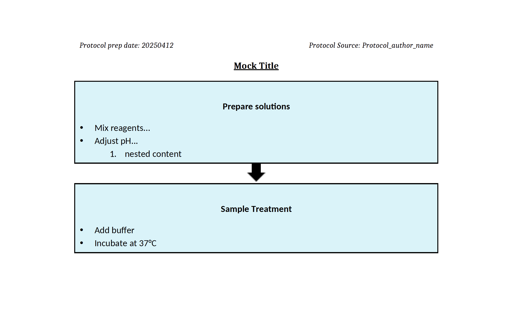

 # 🧾 Protocol Formatter
 
 **Protocol Formatter** is a lightweight and efficient tool that converts plain-text protocol instructions into neatly formatted documents for sharing or printing. Whether you're organizing lab experiments, technical procedures, or step-by-step tasks, this tool ensures clarity, consistency, and professional presentation.
 
 ---
 
 ## ✨ Features
 
 - Convert plaintext `.txt` protocols into a styled `.pdf` format
 - Supports common formatting patterns (headers, numbered steps, notes)
 - Handles special formatting like bolded sections or code blocks
 - Outputs both `.pdf` and `.png` for previews or print
 - Clean typography and spacing for professional documentation
 
 ---
 
 ## 🛠 How to Use
 
 1. **Install the tool** (after packaging or from PyPI):
     ```bash
     pip install protocol-formatter
     ```
 
 2. **Run it anywhere in your terminal**:
     ```bash
     protocol-formatter
     ```
 
 3. **Follow the prompt** to provide the path to your `.txt` file. The script will output:
     - A formatted `.pdf` document
     - A `.png` preview of the first page
 
 ---
 
 ## 📁 Input Example
 
 ```
 - Prepare solutions
* Mix reagents...
* Adjust pH...
** nested content

- Sample Treatment
* Add buffer
* Incubate at 37°C
 ```
 
 ---
 
 ## 📤 Output Preview
 
 A polished `.pdf` and `.png` output will be created in the same folder. See sample output below:
 
 
 
 ---
 
 ## ⚙️ CLI Integration
 
 After installation, use:
 ```bash
 protocol-formatter path/to/your_protocol.txt
 ```
 
 ---
 
 ## 📄 License
 
 MIT License © 2025 AdhikariPB